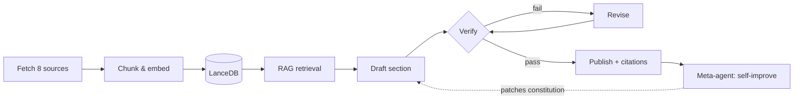

# Sentient

> The AI that watches AI — and audits itself.


---

## What is Sentient?

Sentient is a self-running intelligence terminal that monitors the entire AI ecosystem 24/7 — across research, open source, markets, and company blogs — and turns the noise into a grounded daily briefing. Its core is a closed self-verifying agent loop: it drafts each section, runs a critic pass to catch hallucinations and untraceable claims, revises until the facts hold, and publishes only what survives. After every run it inspects its own failures and rewrites its operating constitution, so it gets stricter over time. The whole process is exposed through a Bloomberg-style live dashboard that shows every fetch, every retrieval, and every decision as it happens.

## Screenshots

### Workstation


### Monitoring — Neural Decision Graph


### Stock Deep-Dive


## Features

- 🧠 Self-verifying agent loop (draft → verify → revise → publish)
- 🔄 Self-improving via `agent_memory.json` — patches its own constitution after every run
- 📡 Live monitoring of 8 data sources (arXiv, GitHub, RSS feeds, stocks, Reddit, HuggingFace, GDELT, Papers With Code)
- 📊 Bloomberg terminal layout with real-time panels
- 🕸️ Live knowledge graph — AI company connections from today's briefing
- 🧬 Neural network decision visualizer — watch every agent decision in real time
- 📈 30-day candlestick charts with volume for 8 AI stocks (NVDA, MSFT, GOOGL, AMD, TSM, AVGO, ORCL, PLTR)
- 🔍 RAG pipeline — LanceDB + Gemini embeddings, semantic search
- 💬 Analyst chat — ask questions about today's fetched data
- 🚨 Source health monitoring with uptime tracking and alerts
- 📰 Streaming daily briefing with citation tracking and verification reports

## How it works



Sources are fetched, deduplicated, chunked, and embedded into LanceDB. For each briefing topic the agent retrieves the most relevant chunks, drafts a section, and hands it to a critic that checks every claim against the source chunks. Failed sections are revised and re-verified (up to three attempts) before publishing with inline citations. When the run finishes, a meta-agent reviews every violation it caught and writes new rules back into the constitution for next time.

## Tech stack

| Layer | Technology |
|---|---|
| Framework | Next.js 14 (App Router) |
| Language | TypeScript |
| Styling | Tailwind CSS |
| Charts | lightweight-charts v5 (TradingView) |
| Graphs | D3.js v7 |
| LLM Generation | Groq API (qwen/qwen3-32b) |
| Embeddings | Gemini (gemini-embedding-001) |
| Vector Store | LanceDB |
| Streaming | Server-Sent Events (SSE) |
| Cron | node-cron |

## Data sources

| Source | Type | Auth |
|---|---|---|
| arXiv | Research papers | None |
| GitHub Trending | Repos | Optional token |
| RSS Feeds | Company blogs (OpenAI, Anthropic, DeepMind, xAI, Meta, Mistral, Cohere, DeepSeek) | None |
| Yahoo Finance | Stock prices + 30-day OHLCV | None |
| Reddit | Community signals | OAuth2 (free) |
| HuggingFace Hub | Model releases | None |
| GDELT | Global news | None |
| Papers With Code | ML benchmarks | None |

## Quickstart

### Prerequisites

- Node.js 18+
- Groq API key (free at [console.groq.com](https://console.groq.com))
- Google AI Studio API key (free at [aistudio.google.com](https://aistudio.google.com))

### Setup

```bash
# 1. Clone
git clone https://github.com/lucky07-07/sentient
cd sentient

# 2. Install
npm install

# 3. Configure
cp .env.example .env.local
# Add your GROQ_API_KEY and GEMINI_API_KEY

# 4. Run
npm run dev

# 5. Open
open http://localhost:3000
# Click "Run Fetch" then "Run Briefing"
```

## Environment variables

| Variable | Required | Description |
|---|---|---|
| `GROQ_API_KEY` | ✅ | Groq API key — generation (qwen3-32b). Free at console.groq.com |
| `GEMINI_API_KEY` | ✅ | Google AI Studio key — embeddings only. Free at aistudio.google.com |
| `GROQ_MODEL` | No | Override model (default: `qwen/qwen3-32b`) |
| `GEMINI_EMBED_MODEL` | No | Override embed model (default: `gemini-embedding-001`) |
| `REDDIT_CLIENT_ID` | No | Reddit OAuth — enables r/LocalLLaMA etc. |
| `REDDIT_CLIENT_SECRET` | No | Reddit OAuth secret |
| `GITHUB_TOKEN` | No | Higher GitHub API rate limits |

## Recording a 30-second demo

1. **(0–5s)** Open `http://localhost:3000` — show the Bloomberg terminal layout.
2. **(5–10s)** Click **Run Fetch** — watch the Agent Log fill with live source data and the stock ticker scroll.
3. **(10–18s)** Click **Run Briefing** — watch the pipeline in the Agent Log: retrieve → draft → verify → (revise if needed) → publish. Briefing sections stream in one by one.
4. **(18–22s)** Switch to the **Monitoring** tab — show the neural decision graph firing, the source-health strip, and the verification loop.
5. **(22–26s)** Back to the **Workstation** — click any stock card to open the 30-day candlestick modal with volume bars.
6. **(26–30s)** Show the **Knowledge Graph** populating with company/topic nodes and live pulse connections.

## License

[MIT](LICENSE) © Anil Kumar
