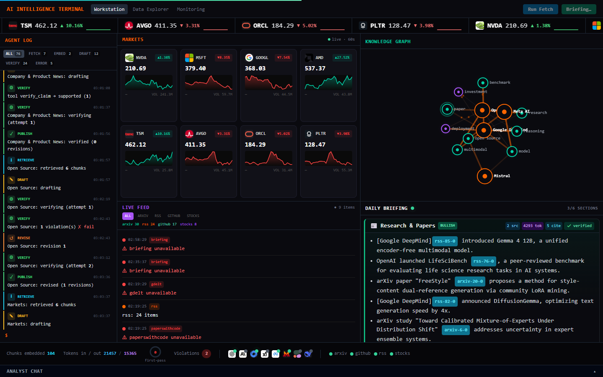
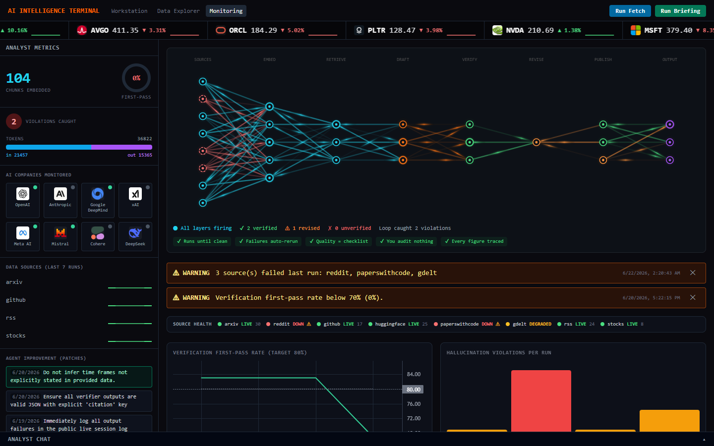
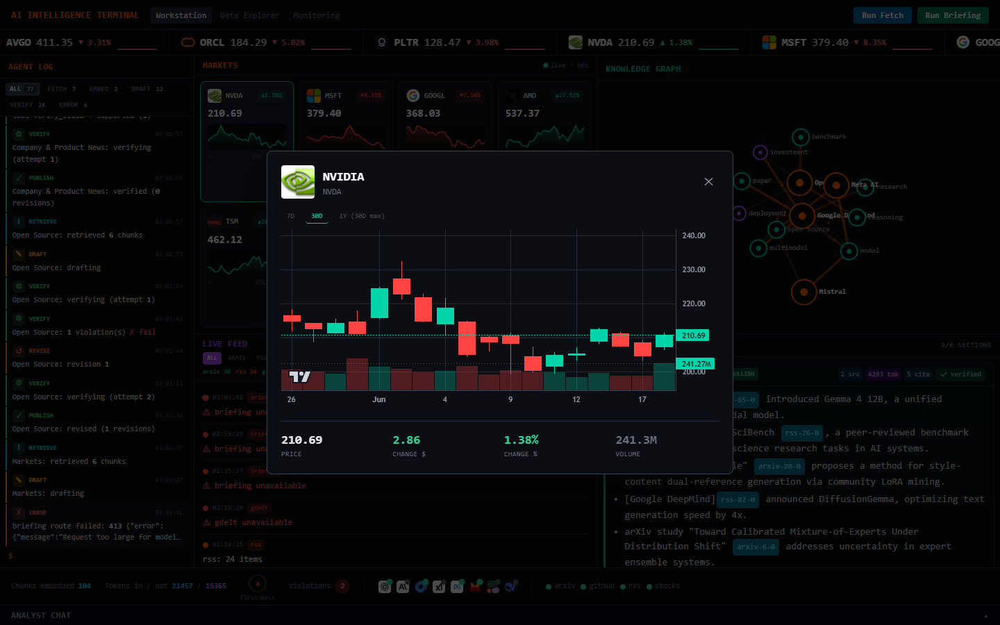
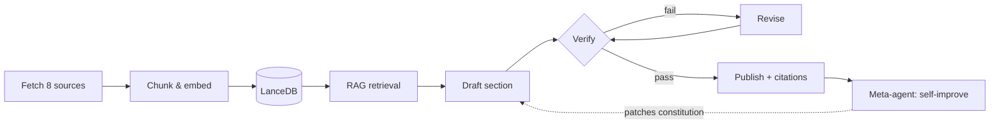
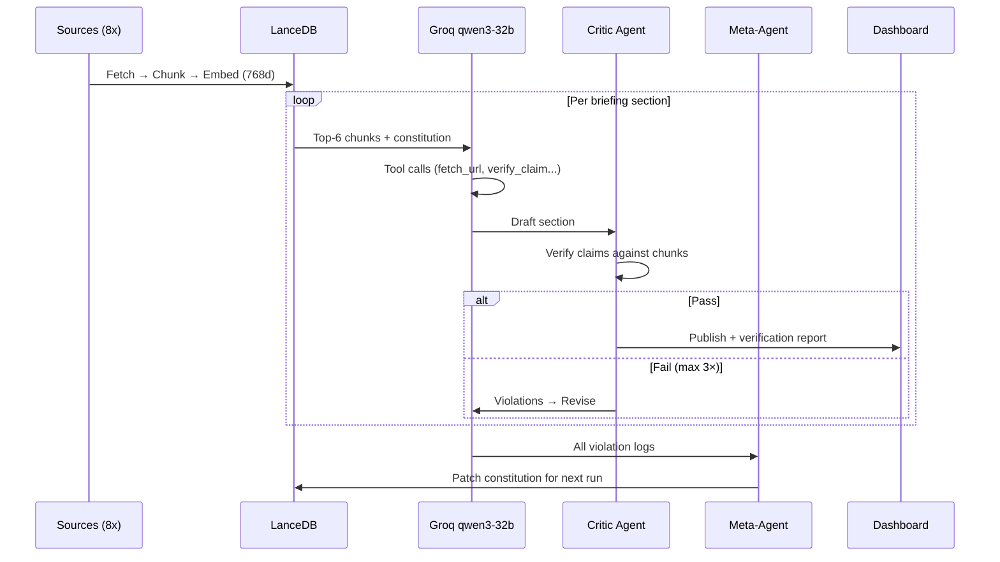

# Sentient

> The AI that watches AI — and audits itself.

> 📹 **[30-second demo script](README.md#recording-a-30-second-demo)** — record your own walkthrough using the guide below


---

## What is Sentient?

Sentient is a self-running intelligence terminal that monitors the entire AI ecosystem 24/7 — across research, open source, markets, and company blogs — and turns the noise into a grounded daily briefing. Its core is a closed self-verifying agent loop: it drafts each section, runs a critic pass to catch hallucinations and untraceable claims, revises until the facts hold, and publishes only what survives. After every run it inspects its own failures and rewrites its operating constitution, so it gets stricter over time. The whole process is exposed through a Bloomberg-style live dashboard that shows every fetch, every retrieval, and every decision as it happens.

## Screenshots

### Workstation — Bloomberg Terminal


### Monitoring — Neural Decision Graph


### Stock Deep-Dive — 30-Day Candlesticks


## Features

- 🧠 Self-verifying agent loop (draft → verify → revise → publish)
- 🔄 Self-improving via `agent_memory.json` — patches its own constitution after every run
- 📡 Live monitoring of 8 data sources (arXiv, GitHub, RSS feeds, stocks, Reddit, HuggingFace, GDELT, Papers With Code)
- 📊 Bloomberg terminal layout with real-time panels
- 🕸️ Live knowledge graph — AI company connections from today's briefing
- 🧬 Neural network decision visualizer — watch every agent decision in real time
- 📈 30-day candlestick charts with volume for 8 AI stocks (NVDA, MSFT, GOOGL, AMD, TSM, AVGO, ORCL, PLTR)
- 🔍 RAG pipeline — LanceDB + Gemini embeddings, semantic search
- 💬 Analyst chat — ask questions about today's fetched data
- 🚨 Source health monitoring with uptime tracking and alerts
- 📰 Streaming daily briefing with citation tracking and verification reports

## How it works



Sources are fetched, deduplicated, chunked, and embedded into LanceDB. For each briefing topic the agent retrieves the most relevant chunks, drafts a section, and hands it to a critic that checks every claim against the source chunks. Failed sections are revised and re-verified (up to three attempts) before publishing with inline citations. When the run finishes, a meta-agent reviews every violation it caught and writes new rules back into the constitution for next time.

## Tech Stack

### Frontend
| Technology | Role |
|---|---|
| Next.js 14 (App Router) | Full-stack framework — API routes + React UI |
| React 18 | UI library with SSE streaming |
| Tailwind CSS | Styling |
| lightweight-charts v5 | TradingView candlestick + volume charts |
| D3.js v7 | Force-directed knowledge graph + canvas rendering |
| Canvas API | Neural decision visualizer, animated knowledge graph |
| Server-Sent Events | Real-time agent log streaming to browser |

### AI & RAG Pipeline
| Technology | Role |
|---|---|
| **RAG Type** | **Agentic RAG + Self-Reflective RAG + Adaptive RAG** |
| Groq API (qwen/qwen3-32b) | LLM generation — reasoning model with tool calling |
| Gemini gemini-embedding-001 | Text → 768-dim vector embeddings |
| LanceDB | Local vector store — chunk storage + cosine similarity search |
| **Retrieval** | Top-K semantic search per topic (K=6 chunks per section) |
| **Generation** | Groq function calling with 5 tools: fetch_url, get_stock_price, compare_benchmarks, classify_news, verify_claim |
| **Self-Reflection** | Critic model call verifies every draft against source chunks before publish |
| **Adaptive** | Meta-agent patches the system constitution after each run via agent_memory.json |
| **Agent Loop** | Draft → Verify → Revise (max 3×) → Publish → Self-improve |

### Why Agentic RAG?
Standard RAG retrieves chunks and generates once. Sentient's pipeline is agentic because:
- The LLM **decides** when to call tools mid-generation (not a fixed pipeline)
- A **critic agent** verifies output against source chunks and triggers revision
- A **meta-agent** analyzes failure patterns and rewrites the system prompt
- The retrieval loop is **adaptive** — constitution patches change what gets retrieved and how it's verified on the next run

### Backend & Infrastructure
| Technology | Role |
|---|---|
| Next.js API Routes | /api/fetch, /api/briefing, /api/cron, /api/stream, /api/search, /api/chat, /api/metrics, /api/logo |
| node-cron | Daily automated pipeline trigger (08:00) |
| node-fetch / native fetch | Source data fetching with 503/429 retry backoff |
| TypeScript | Full type safety across all layers |

## Architecture

### System Overview

```mermaid
graph TD
    subgraph Sources["Data Sources"]
        S1[arXiv API]
        S2[Reddit OAuth2]
        S3[GitHub Trending]
        S4[HuggingFace Hub]
        S5[GDELT News]
        S6[Yahoo Finance]
        S7[Papers With Code]
        S8[AI Company RSS]
    end

    subgraph Pipeline["Ingestion Pipeline"]
        F[/api/fetch]
        D[Deduplicate]
        C[Chunk 500 tokens]
        E[Gemini Embeddings<br/>gemini-embedding-001<br/>768 dims]
        V[(LanceDB<br/>Vector Store)]
    end

    subgraph AgentLoop["Agentic RAG Loop"]
        R[Retrieve top-K chunks]
        G[Groq qwen3-32b<br/>Draft section]
        CR[Critic Agent<br/>Verify claims]
        RV{Pass?}
        RE[Revise]
        PB[Publish section]
        MA[Meta-Agent<br/>Self-improve]
        AM[(agent_memory.json<br/>Constitution patches)]
    end

    subgraph Tools["Agent Tools"]
        T1[fetch_url]
        T2[get_stock_price]
        T3[compare_benchmarks]
        T4[classify_news]
        T5[verify_claim]
    end

    subgraph Dashboard["Live Dashboard"]
        SSE[SSE Stream]
        UI[Bloomberg Terminal UI]
        KG[Knowledge Graph]
        NN[Neural Decision Visualizer]
        SC[Stock Charts]
        AC[Analyst Chat]
    end

    Sources --> F
    F --> D --> C --> E --> V
    V --> R --> G
    G --> T1 & T2 & T3 & T4 & T5
    T1 & T2 & T3 & T4 & T5 --> G
    G --> CR --> RV
    RV -- fail --> RE --> CR
    RV -- pass --> PB
    PB --> MA --> AM
    AM -.->|next run| R
    PB --> SSE --> UI
    V --> KG & AC
    PB --> NN
```

### Agentic RAG Flow



## Data sources

| Source | Type | Auth |
|---|---|---|
| arXiv | Research papers | None |
| GitHub Trending | Repos | Optional token |
| RSS Feeds | Company blogs (OpenAI, Anthropic, DeepMind, xAI, Meta, Mistral, Cohere, DeepSeek) | None |
| Yahoo Finance | Stock prices + 30-day OHLCV | None |
| Reddit | Community signals | OAuth2 (free) |
| HuggingFace Hub | Model releases | None |
| GDELT | Global news | None |
| Papers With Code | ML benchmarks | None |

## Quickstart

### Prerequisites

- Node.js 18+
- Groq API key (free at [console.groq.com](https://console.groq.com))
- Google AI Studio API key (free at [aistudio.google.com](https://aistudio.google.com))

### Setup

```bash
# 1. Clone
git clone https://github.com/lucky07-07/sentient
cd sentient

# 2. Install
npm install

# 3. Configure
cp .env.example .env.local
# Add your GROQ_API_KEY and GEMINI_API_KEY

# 4. Run
npm run dev

# 5. Open
open http://localhost:3000
# Click "Run Fetch" then "Run Briefing"
```

## Environment variables

| Variable | Required | Description |
|---|---|---|
| `GROQ_API_KEY` | ✅ | Groq API key — generation (qwen3-32b). Free at console.groq.com |
| `GEMINI_API_KEY` | ✅ | Google AI Studio key — embeddings only. Free at aistudio.google.com |
| `GROQ_MODEL` | No | Override model (default: `qwen/qwen3-32b`) |
| `GEMINI_EMBED_MODEL` | No | Override embed model (default: `gemini-embedding-001`) |
| `REDDIT_CLIENT_ID` | No | Reddit OAuth — enables r/LocalLLaMA etc. |
| `REDDIT_CLIENT_SECRET` | No | Reddit OAuth secret |
| `GITHUB_TOKEN` | No | Higher GitHub API rate limits |

## Recording a 30-second demo

1. **(0–5s)** Open `http://localhost:3000` — show the Bloomberg terminal layout.
2. **(5–10s)** Click **Run Fetch** — watch the Agent Log fill with live source data and the stock ticker scroll.
3. **(10–18s)** Click **Run Briefing** — watch the pipeline in the Agent Log: retrieve → draft → verify → (revise if needed) → publish. Briefing sections stream in one by one.
4. **(18–22s)** Switch to the **Monitoring** tab — show the neural decision graph firing, the source-health strip, and the verification loop.
5. **(22–26s)** Back to the **Workstation** — click any stock card to open the 30-day candlestick modal with volume bars.
6. **(26–30s)** Show the **Knowledge Graph** populating with company/topic nodes and live pulse connections.

## License

[MIT](LICENSE) © Anil Kumar
